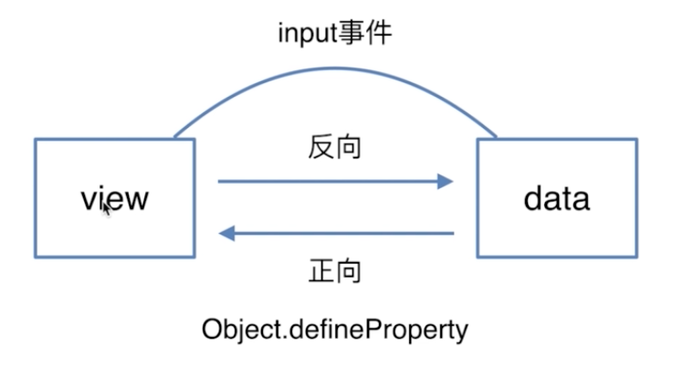
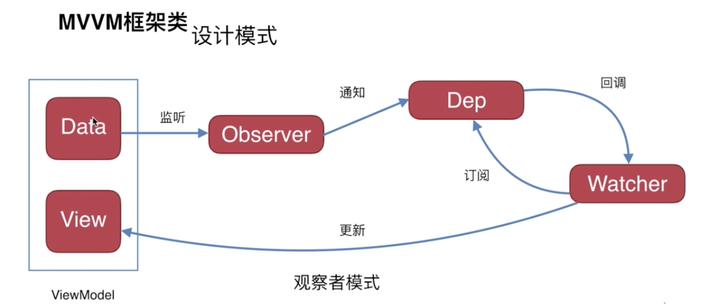

## 双向绑定的原理
### 1. 原理：



### 2.[Object.defineProperty()](https://developer.mozilla.org/zh-CN/docs/Web/JavaScript/Reference/Global_Objects/Object/defineProperty)

[练习](./index.html)

``` javascript
     var obj2 = {};
     Object.defineProperty(obj2, 'key', {
       enumerable: true,
       configurable: false,
       writable: false,
       value: 'static'
     })
     //  把descripter的enumerable改为true，则可遍历
     for(let i in obj2){
       console.log(i) // key
     }
```
### 3. mvvm框架类



