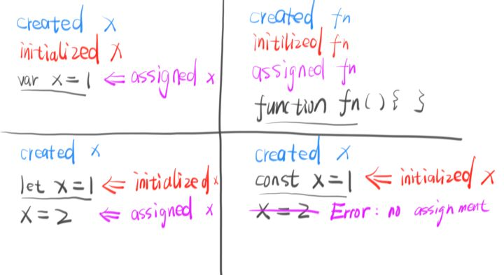

### for循环中的let

```javascript
   // 猜猜示例一、二分别会打印出什么？
   // 示例一
     var liList = document.querySelectorAll('li');
     for(var i = 0; i < liList.length; i++) {
       liList[i].onclick = function() {
         console.log(i);
       }
     }
    // 示例二
     var liList = document.querySelectorAll('li');
     for(let i = 0; i < liList.length; i++) {
       liList[i].onclick = function() {
         console.log(i);
       }
     }
```
- MDN解释： 以上示例的工作原理是因为（匿名）内部函数的五个实例引用了变量i的五个不同实例

### 声明提升
- **var 声明的【创建、初始化和赋值】过程**
```javascript
  function fn() {
    console.log(x);  // undefined
    var x = 1;
    var y = 2;
  }
  fn();
```
**过程**：
1. 进入fn，为fn创建一个环境
2. 找到fn中所有用var声明的变量，在这个环境中【创建】这些变量（即x和y）
3. 将这些变量【初始化】为undefined
4. 开始执行代码
5. x = 1将x变量【赋值】为1

- **function 声明的【创建、初始化和赋值】过程**
```javascript
  fn();
  function fn2(){
    console.log(2);
  }
```
**过程**：
1. 找到所有function声明的变量，在环境中【创建】这些变量
2. 将这些变量【初始化】并【赋值】为function(){console.log(2)}
3. 开始执行代码fn2()

- **let 声明的【创建、初始化和赋值】过程**
```javascript
{
  console.log(x) // Uncaught ReferenceError: x is not defined
  let x = 1;
  x = 2;
}
```
**{}里边的过程**：
1. 找到所有用let声明的变量，在环境中【创建】这些变量
2. 开始执行代码（还未初始化）
3. 执行x = 1，将x【初始化】为1 （这并不是一次赋值，如果是let x,就将x初始化为undefined）
4. 执行x = 2，对x进行【赋值】

#### 3.总结


- let的【创建】过程被提升了，但是初始化没有提升
- var的【创建】和【初始化】都被提升了
- function 的【创建】【初始化】【赋值】都被提升了

原文地址: [我用了两个月的时间才理解 let](https://zhuanlan.zhihu.com/p/28140450)