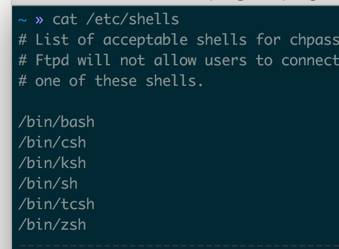

# bash/zsh/item区别

要搞懂这些的区别，首先需要理解什么是[shell](https://zh.wikipedia.org/wiki/%E6%AE%BC%E5%B1%A4)。

## shell

**壳层** 指“为用户提供用户界面”的软件，通常指的是[命令行界面](https://zh.wikipedia.org/wiki/%E5%91%BD%E4%BB%A4%E8%A1%8C%E7%95%8C%E9%9D%A2)的解析器。一般来说，这个词是指操作系统中，提供访问内核所提供之服务的程序。Shell也用于泛指所有为用户提供操作界面的程序，也就是程序和用户交互的接口。因此与之相对的是程序内核，内核不提供和用户交互功能。
通常将shell分为两类：命令行与图形界面。命令行壳层提供一个命令行界面（CLI/command line interface），而图像壳层提供一个图像用户界面（GUI/graphical user interface)
Linux/Unix提供了很多种Shell，查看有哪些Shell
```zsh
cat /etc/shells
```


查看当前使用的shell
```bash
echo $SHELL
```
切换shell

```bash
chsh -s /bin/zsh
```

所以[zsh](https://wiki.archlinux.org/index.php/Zsh_(%E7%AE%80%E4%BD%93%E4%B8%AD%E6%96%87))和[bash](https://wiki.archlinux.org/index.php/Bash_(%E7%AE%80%E4%BD%93%E4%B8%AD%E6%96%87))都属于shell的一种，zsh在兼容bash的的同时，还提供的很多改进，例如：
- 更高效
- 更好的自动补全
- 更好的文件名展开
- 更好的数组处理
- 可定制性高

zsh虽然强大，但配置起来复杂，所以一般还会安装oh-my-zsh来管理zsh的配置

## 安装oh-my-zsh
- 设置默认的shell为zsh
```zsh
chsh -s /bin/zsh
```
- 在终端执行下面语句来安装

```zsh
sh -c "$(curl -fsSL https://raw.githubusercontent.com/robbyrussell/oh-my-zsh/master/tools/install.sh)"

```
- 配置文件修改及生效
```zsh
vi  ~/.zshrc

source ~/.zshrc
```
## iTerm2
iTerm2是mac下最好的终端工具，如下是一些特殊功能：
- 智能选中

  双击选中，三击选中正行，四击智能选中，可以识别网址，引号引起的字符串，邮箱地址。
在iTerm2中，选中即复制。任何选中状态的字符串都被放到了系统剪切板中

- 巧用Command键

  按住command键：
可以拖拽选中的字符串，点击url：调用默认浏览器访问该网址；点击文件：调用默认程序打开文件；点击文件夹：在finder中打开该文件夹；同时按住option键，可以以矩形选中

- 常用快捷键

  切换tab: ⌘ + ← ，⌘ + →，⌘ + {，⌘ + }，⌘ + 数字直接定位到该tab；
  新建tab: ⌘ + t；
  顺序切换pane: ⌘ + [, ⌘ + ]；
  按方向切换pane: ⌘ + Option + 方向键；
  切分屏幕： ⌘ + d 水平切分，⌘ + Shift + d垂直切分；
  智能查找，支持正则查找： ⌘ + f
  
  